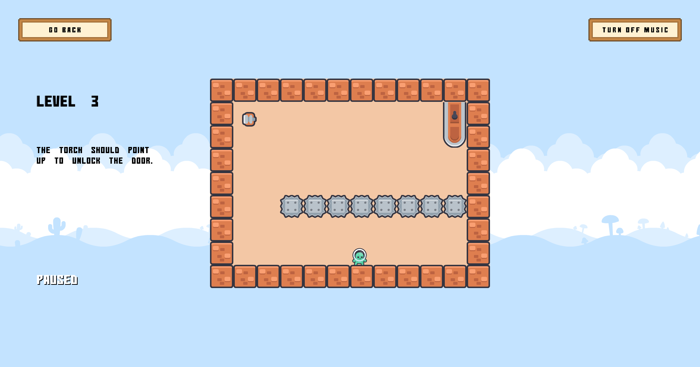

# What's Up Game

A puzzle game made as a part of 'Very Serious Juniper Dev Game Jam'. In this game, you spin the level to win.



## Usage

To compile the project, use one of the following dependending on your build target.

### Desktop

Use the following to build for desktop:

``` bash
cmake -B build
cmake --build build
```

### Web

Compiling for the web requires the [Emscripten SDK](https://emscripten.org/docs/getting_started/downloads.html):

``` bash
mkdir build-web
cd build-web
emcmake cmake .. -DPLATFORM=Web -DCMAKE_BUILD_TYPE=Release -DCMAKE_EXECUTABLE_SUFFIX=".html"
emmake make
```
